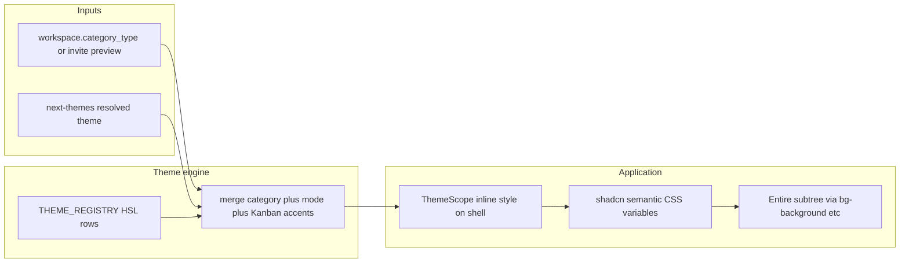

# Technical design (v2): multi-theme engine

**Supersedes:** draft v1 (`tdd-multi-theme-engine-v1.md`). This file is the canonical TDD.

This document translates the reference prototype in [`mocks/theme/theme-engine-mock`](../mocks/theme/theme-engine-mock) into an implementation-backed plan for BuddyBubble. **Architect decisions below are locked** for execution.

## 1. Reference prototype summary

The mock is a self-contained React UI that demonstrates:

| Concept                                 | Behavior in mock                                                                                                                                                                                                                        |
| --------------------------------------- | --------------------------------------------------------------------------------------------------------------------------------------------------------------------------------------------------------------------------------------- |
| **Theme axis 1 — BuddyBubble category** | Four presets aligned with `WorkspaceCategory`: `business`, `kids`, `community`, `class`. Each has a display `name` and a stable `id`.                                                                                                   |
| **Theme axis 2 — light / dark**         | Boolean `isDark`; merged with category tokens at runtime.                                                                                                                                                                               |
| **Token model**                         | CSS custom properties applied via `style={activeTokens}` on the app root.                                                                                                                                                               |
| **Structural split**                    | **Shared “chrome” tokens** (`tokens`): rail, sidebar backgrounds, sidebar text/active/hover, primary palette. **Mode-specific surface tokens** (`light` / `dark`): app background, panel, border, main/muted text, neutral button fill. |
| **Semantic accents**                    | Yellow / red / orange / blue / green for badges and card rails; each has base, `-bg`, `-text`; backgrounds use opacity in dark mode to avoid glare.                                                                                     |
| **Utility classes**                     | Injected `<style>` block maps tokens to classes: `themed-app`, `themed-panel`, etc. **Production replaces this pattern** by driving shadcn semantic tokens (see §6).                                                                    |
| **UX affordance**                       | Theme switcher in sidebar footer: palette label, light/dark toggle, per-category pills.                                                                                                                                                 |

The mock does **not** define persistence, SSR, or **`next-themes`** — those are specified in §7–§8.

## 2. Current codebase context

- **Workspace category** is already a first-class concept: `WorkspaceCategory` in [`src/types/database.ts`](../src/types/database.ts) (`business` | `kids` | `class` | `community`), stored on `workspaces.category_type`, surfaced in [`src/store/workspaceStore.ts`](../src/store/workspaceStore.ts) and the dashboard ([`src/components/dashboard/dashboard-shell.tsx`](../src/components/dashboard/dashboard-shell.tsx)).
- **Invite preview** already receives category context from **`get_invite_preview`** (see [`/invite/[token]`](../src/app/invite/[token]/page.tsx) and onboarding docs).
- **Global styling** uses **shadcn/Tailwind v4** semantic tokens in [`src/app/globals.css`](../src/app/globals.css) (`bg-background`, `text-foreground`, `.dark` variant, etc.).

## 3. Goals

1. **Category-driven visual identity** — Chrome and key surfaces reflect the active workspace’s category (or invite preview category on `/invite/[token]`).
2. **Light / dark** — **User-global** preference via **`next-themes`**; category palette merges on top of resolved light/dark.
3. **Single source of truth** — Central `THEMES` registry (typed `WorkspaceCategory`), outputting values consumable by the design system.
4. **Accessibility** — Contrast for text and controls; Kanban accent badges remain readable in both modes.

## 4. Non-goals (initial milestones)

- Per-user arbitrary color pickers.
- Full removal of every hardcoded `slate-*` / legacy color in one PR (phased rollout remains).
- Server-persisted theme preference (optional later; **`next-themes`** + `localStorage` is sufficient for v2).

## 5. Architecture (locked)

- **Category:** From **`workspace.category_type`** (dashboard) or RPC preview (invite page).
- **Light/dark:** From **`next-themes`** (class + `localStorage` + script to reduce hydration flash).
- **Engine:** Pure merge: `(category, resolvedMode) => CSS variables` in **shadcn HSL token format** (space-separated components, no `hsl()` wrapper — matches existing globals pattern).
- **Application:** `ThemeScope` injects variables on **`DashboardShell`** wrapper and on **`/invite/[token]`** layout/card scope (Phase 1).

## 6. Shadcn integration strategy (locked)

**Overwrite shadcn’s semantic HSL variables** — do **not** introduce parallel trees like `--app-bg` / `--text-main` for the main app or manually retheme every component.

1. Refactor the mock’s `THEMES` data so each resolved row maps to **globals’ variable names**: e.g. `--background`, `--foreground`, `--card`, `--card-foreground`, `--primary`, `--primary-foreground`, `--border`, `--muted`, `--muted-foreground`, `--accent`, `--accent-foreground`, sidebar-related tokens if present in [`globals.css`](../src/app/globals.css), etc.
2. Values MUST be **HSL components** as shadcn expects (e.g. `'25 100% 4%'` for background, `'24 93% 53%'` for primary — examples only; final numbers come from design pass / conversion from mock hex).
3. Apply via **inline `style`** on `ThemeScope` (or equivalent wrapper), e.g. `
`. Components using **`bg-background`**, **`text-primary`**, etc. **inherit the theme with zero rewrites**.

**Kanban semantic badges (exception):** shadcn has no 1:1 for yellow/red/orange/blue/green warning-info-task states. **Retain the mock’s `--accent-yellow`**, `--accent-red`, etc., including **dark-mode alpha backgrounds** / light-mode solid fills, **only** where Kanban (and similar) badges need them. The registry merge function adds these alongside the shadcn variables.

## 7. Persistence and separation of concerns (locked)

| Concern              | Mechanism                                                                                                                |
| -------------------- | ------------------------------------------------------------------------------------------------------------------------ |
| **Light / dark**     | **`next-themes`**, user-global, device/browser (`localStorage` + anti-FOUC script).                                      |
| **Category palette** | **Strictly derived** from `workspace.category_type` (or invite preview `category_type`). Not a separate user preference. |

**Merge rule:** `next-themes` answers “render light or dark”; the workspace (or invite) answers “which of the four category rows”; the theme engine **merges** both into one variable map.

## 8. Invite preview unification (locked, Phase 1)

Use the **same `ThemeScope` + registry** on [`/invite/[token]`](../src/app/invite/[token]/page.tsx) (via **`InviteThemeWrapper`**) so the invite card matches the destination workspace category. The old `src/lib/invite-preview-theme.ts` module was **removed** once this path shipped; invite chrome is entirely **semantic tokens + `--invite-accent`** from **`THEME_REGISTRY`**.

**Phase 1 success criteria** include: dashboard shell **and** invite preview both reflect category + `next-themes` mode.

## 9. Reduced motion (locked)

Production should **not** rely on unconditional `transition-colors duration-300` for theme changes. Map theme-related transitions in **global CSS** or the UI wrapper so that **`motion-reduce:transition-none`** (or Tailwind’s `motion-reduce:` utilities) applies; users with motion sensitivity get **instant** theme snaps.

## 10. Phased rollout

| Phase                                    | Scope                                                                          | Success criteria                                     |
| ---------------------------------------- | ------------------------------------------------------------------------------ | ---------------------------------------------------- |
| **0 — Design lock**                      | HSL token sheet per category × mode vs `globals.css` variable list             | Sign-off                                             |
| **1 — Engine + DashboardShell + invite** | `THEME_REGISTRY`, merge, `ThemeScope`, `next-themes`; wrap shell + invite page | Workspace + invite match category; light/dark global |
| **2 — Chat + Kanban**                    | Remove straggling hardcoded neutrals; wire **`--accent-*`** for badges/cards   | Main flows match mock intent                         |
| **3 — Polish**                           | Modals, settings, remnants; a11y pass                                          | Cohesive UI                                          |

## 11. Risks and mitigations

| Risk                          | Mitigation                                                                                                                                                              |
| ----------------------------- | ----------------------------------------------------------------------------------------------------------------------------------------------------------------------- |
| Hydration / FOUC              | **`next-themes`** default blocking script pattern                                                                                                                       |
| Contrast on bold palettes     | Automated checks on registry rows; tweak HSL                                                                                                                            |
| Tailwind `dark:` vs variables | Resolve theme through **`next-themes`** `class="dark"` on root; variables for `.dark` already defined in shadcn — engine supplies values that match the active category |

## 12. Testing strategy

- **Unit:** `mergeWorkspaceTheme(category, resolvedMode)` returns expected **shadcn** keys + HSL strings + Kanban `--accent-*` where applicable.
- **Manual / visual:** Four categories × light/dark on dashboard; same on invite preview for each category.
- **Motion:** Verify reduced-motion disables long color transitions.

## 13. File / module sketch

- `src/lib/theme-engine/registry.ts` — category rows in **HSL** (shadcn-shaped).
- `src/lib/theme-engine/merge.ts` — merges category + mode + accent badge variables.
- `src/components/theme/ThemeScope.tsx` — applies `style={vars}`; children = dashboard or invite subtree.
- **`next-themes`**: `ThemeProvider` at app root (or layout); toggle in profile/settings later if not in mock location.

## 14. Resolved decisions (formerly open questions)

| Topic                        | Resolution                                                                                                                |
| ---------------------------- | ------------------------------------------------------------------------------------------------------------------------- |
| Shadcn vs parallel variables | **Overwrite shadcn semantic HSL variables** via scoped inline style; no app-wide `--app-bg` parallel tree.                |
| Light/dark scope             | **User-global** via **`next-themes`**.                                                                                    |
| Category source              | **Database / RPC** only (`category_type`); not user-picked palette storage.                                               |
| Invite preview               | **Unify in Phase 1** with same engine as dashboard.                                                                       |
| Kanban title vs chrome       | [`kanban-board-title.ts`](../src/lib/kanban-board-title.ts) remains copy-only; chrome comes from shared shadcn variables. |
| Reduced motion               | **Tailwind / global CSS** — `motion-reduce:transition-none` (or equivalent) on theme transitions.                         |

---

## 15. Execution directives

1. **Shadcn mapping:** Refactor the mock’s `THEMES` constant into **HSL space values** formatted for shadcn (e.g. `222.2 84% 4.9%` style components without wrapping `hsl()`). `ThemeScope` injects these as inline `style` variables (`--background`, `--card`, `--primary`, etc.) on the **`DashboardShell`** wrapper (and invite scope in Phase 1).
2. **State management:** Use **`next-themes`** for resolved light/dark. Use **active workspace** (or invite preview) for **`activeTheme`** (`business` | `kids` | `community` | `class`).
3. **Accent badges:** Retain the mock’s **`--accent-*`** dynamic opacity / light-vs-dark fill logic **specifically for Kanban badges** (and similar semantic states), since shadcn does not provide a direct equivalent for those warning/info/destructive/success task affordances.

---

**Document status:** **Locked v2** — ready for implementation. Reference mock: [`mocks/theme/theme-engine-mock`](../mocks/theme/theme-engine-mock).
