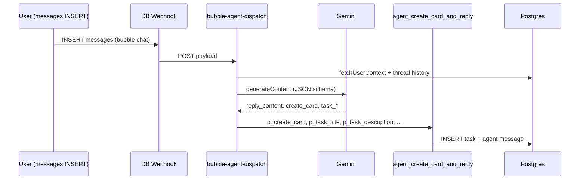

# Technical design: Bubble Coach — natural conversational intake (thread → card → task comments) — v1

## 1. Problem

The `@Coach` flow is implemented today as a **single-turn** decision inside `supabase/functions/bubble-agent-dispatch/index.ts`: each new user `messages` row triggers Gemini once, and the model returns `reply_content`, `create_card`, `task_title`, and `task_description`. The Edge Function then calls `public.agent_create_card_and_reply`, which may create a **Kanban card** (`public.tasks`) and an **agent chat reply** in the same transaction.

After tightening prompts and schema (e.g. required `task_title` / `task_description`, richer `task_description` copy), the model often satisfies the written **“static checklist”** (goal + schedule + equipment) using `**CURRENT USER CONTEXT`** from `fetchUserContext()`. That is correct for **onboarding completeness**, but it is **wrong for same-day prescription**: a message like *“I’d like to work out outside today”* should start a **consultative thread\** (sleep, energy, intent, soreness, equipment *today\*, etc.)—not immediately materialize a workout card.

**Product gap:** The system optimizes for **card creation** when profile data exists, instead of optimizing for **trainer-like progression**: context → targeted questions → user answers → _then_ a card with a description that reflects that dialogue.

Secondary gap: **Kanban task comments** (`public.messages.target_task_id`) are the natural place for **prescription notes, warm-up text, or “why this session”** once a card exists, but the current agent path does not describe how **chat thread** content should **flow into** or **complement** the card body and comments.

## 2. Goals

| Goal                          | Description                                                                                                                                                                                            |
| ----------------------------- | ------------------------------------------------------------------------------------------------------------------------------------------------------------------------------------------------------ |
| **Consult-first**             | For typical “I want a workout today / later” intents, **default to `create_card: false`** until enough **situational** and **recovery** context is collected in the **same thread**.                   |
| **Profile-aware questioning** | Questions should **reference** `fitness_profiles`, **last completed** workout, and **next planned** workout (when available), not generic questionnaires every time.                                   |
| **Explicit escape hatch**     | If the user **clearly** asks to “just put it on a card” / “generate the workout now,” the agent may skip ahead **without** blocking legitimate urgency.                                                |
| **Thread continuity**         | Thread replies (no `@mention`, agent already in thread) already load **recent history** into Gemini; design should **rely on and extend** that, not fight it.                                          |
| **Card + comments story**     | Define how `**tasks.description`** vs **task-scoped messages** should split: e.g. structured workout in description; coaching rationale, disclaimers, or follow-ups in **comments\*\* (optional v1.1). |
| **Observable behavior**       | Make “why we did / didn’t create a card” **debuggable** (logs, optional structured fields, metrics)—not only prompt prose.                                                                             |

## 3. Non-goals (v1)

- Replacing the entire agent stack with a long-running state machine service outside Supabase.
- Perfect **NLU** classification of every user utterance (acceptable to use **heuristics + LLM** hybrid).
- **Automatic** editing of an existing card on every follow-up message (could be v2).
- Guaranteeing medically correct training advice (policy and disclaimers remain product/legal scope).

## 4. Definitions

| Term                     | Meaning in BuddyBubble                                                                                                                                  |
| ------------------------ | ------------------------------------------------------------------------------------------------------------------------------------------------------- |
| **Coach thread**         | Slack-style thread: `messages.parent_id` = thread root; user and agent messages alternate.                                                              |
| **Intake**               | The **pre-card** conversation: clarifying **today’s** constraints and subjective readiness.                                                             |
| `**fetchUserContext`\*\* | Edge helper loading `users`, `fitness_profiles`, last **done** workout task, next **todo/in_progress** workout task (`bubble-agent-dispatch/index.ts`). |
| **Card creation gate**   | Anything that sets or overrides `**create_card`\*\* before RPC (model-only today).                                                                      |
| **Task comment**         | `messages` row with `**target_task_id`\*\* set (unified task comments UI: `TaskModalCommentsPanel.tsx`).                                                |

## 5. Current architecture (baseline)

**Important detail:** The system prompt’s **“goal + schedule + equipment”** checklist is **too easy to satisfy** from profile context alone, so `**create_card: true`** fires on the **first** message even when the user only stated a **vague situational intent\*\* (e.g. outdoor today).

## 6. Design principles (product + engineering)

1. **Separate “profile completeness” from “session readiness.”**
   Profile answers _who the client is generally_; session readiness answers _what is appropriate today_.
2. **Prefer server-enforced gates over prompt-only gates.**
   LLMs will drift; a **thin deterministic policy** (or second structured signal) reduces “surprise cards.”
3. **Keep one webhook, one RPC success path** unless there is a strong reason to split; add **structured model outputs** and/or **post-processing** first.
4. **Don’t hard-code one script of questions.**
   Encode **categories of missing information** (readiness, modality preference, equipment _now_, soreness, time budget) and let the model **choose wording** based on context.

## 7. Proposed solution overview (hybrid)

### 7.1 Two-layer gate for `create_card`

| Layer                       | Responsibility                                                                                                                                                                                                                        |
| --------------------------- | ------------------------------------------------------------------------------------------------------------------------------------------------------------------------------------------------------------------------------------- |
| **Layer A — Model**         | Returns `create_card` plus new structured fields (see §8) reflecting its judgment.                                                                                                                                                    |
| **Layer B — Server policy** | After parsing Gemini JSON, **may force** `create_card = false` (and clear stub task fields) when policy says a card is premature; optionally append one sentence to `reply_content` only if needed (prefer not to mutate copy in v1). |

Layer B rules examples (configurable via env or small JSON config table later):

- **First human message in thread** (trigger message is thread root **or** first user message in thread): **disallow** card unless (a) user **explicit** “create the card / put on my board” language **or** (b) model sets a new boolean `**user_explicit_fast_path`\*\* (schema-gated, default false).
- **Minimum human turns** in thread since first Coach engagement: e.g. require **≥ 2** user messages before cards for intents classified as `**session_request`\*\* (see §7.2). Profile-only chit-chat might not increment if you classify carefully—tune in implementation.
- **“Vague location / vibe only”** heuristic: if user message matches lightweight patterns (_outside_, _gym later_, _quick workout_) **and** no recent answers about **energy / soreness / duration**, force `**create_card: false`\*\*.

These heuristics are **not** meant to be perfect; they **capitalize worst-case** behavior (instant card) while the model handles natural phrasing.

### 7.2 Lightweight intent tagging (structured output)

Extend the Gemini `responseSchema` with **non-user-facing** fields (still JSON):

- `intake_phase`: enum-like string, e.g. `greeting | clarifying_session | ready_to_prescribe | other`.
- `session_readiness_score`: integer **0–100** (model-estimated).
- `missing_intake_categories`: array of strings from a **closed vocabulary** (e.g. `sleep_energy`, `modality_preference`, `equipment_today`, `soreness`, `time_budget`, `intensity`, `injury_flags`).

**Prompt contract:** The coach must **ground questions** in `CURRENT USER CONTEXT` (profile, last workout title/date, next planned) and **only** ask for categories still in `missing_intake_categories`.

### 7.3 Enrich `fetchUserContext` for “trainer memory”

Today the context block includes **titles/dates** for last/next workouts. For better questions (“how did lower-body volume feel?”), v1 should add **high-level structure** from the last workout task when available, for example:

- Parse `tasks.metadata` / known workout fields (whatever the app already stores for `item_type = workout`) into a **short text summary**: e.g. _“Last session: Full Body — emphasis legs; completed 2026-04-15.”_
- If parsing is unreliable, **fallback** to title + date only (still better than nothing).

This is **read-only context** for the model; no new tables required for v1.

### 7.4 Thread → Kanban card content split

| Surface                                                | Recommended content                                                                                                                                                                                                                                                                          |
| ------------------------------------------------------ | -------------------------------------------------------------------------------------------------------------------------------------------------------------------------------------------------------------------------------------------------------------------------------------------- |
| `**tasks.title`\*\*                                    | Short, plain label (existing constraints).                                                                                                                                                                                                                                                   |
| `**tasks.description**`                                | **Executable session**: blocks, exercises, sets/reps, rest, equipment used—assumes answers from the thread **or** sane defaults stated explicitly (“defaulting to moderate intensity because…”).                                                                                             |
| **Bubble chat (`reply_content`)**                      | Conversational: confirm assumptions, ask next question, or celebrate—**not** a duplicate of the full JSON workout unless the product wants that.                                                                                                                                             |
| **Task comments (`target_task_id`)** — _optional v1.1_ | “Coach notes”: readiness summary, rationale, scaling options, **post-session check-in prompt**. Implementation options: (a) second message insert after RPC, (b) extend RPC to optionally insert an initial task-scoped message, (c) client-only prompt—**prefer (b)** if atomicity matters. |

## 8. API / schema changes (Gemini JSON)

**Additive** fields on the existing object (parsing must tolerate older models during rollout):

- `intake_phase` (string)
- `session_readiness_score` (integer)
- `missing_intake_categories` (array of strings)
- `user_requested_immediate_card` (boolean, default false) — set **true** only when user language is explicit

**Prompt + Layer B alignment:**

- When `user_requested_immediate_card` is false and policy says “too early,” **override** `create_card` to false and set `task_title` / `task_description` to null before RPC.

**Risk:** Gemini `required` arrays already grew once; adding fields requires updating `**parseGeminiJsonText`\*\* to tolerate missing keys with safe defaults.

## 9. RPC and data model

**No migration strictly required for v1** if task comments are deferred.

If implementing **initial coach comment** on the card:

- **Option 1 (RPC extension):** Add optional `p_seed_task_comment_text` to `agent_create_card_and_reply`, inserted as a `messages` row with `target_task_id = new task id` and `user_id = agent`—**same transaction** as today’s reply.
- **Option 2 (follow-up webhook):** Risky (double webhook, ordering); not recommended.

## 10. Phased rollout

| Phase  | Scope                                                                                                                 | Success criteria                                                                          |
| ------ | --------------------------------------------------------------------------------------------------------------------- | ----------------------------------------------------------------------------------------- |
| **P0** | Prompt rewrite + `fetchUserContext` enrichment (last workout summary)                                                 | Coach asks **1–2** grounded questions on first vague request; cards rarely on first turn. |
| **P1** | Structured `missing_intake_categories` + Layer B **first-message card block**                                         | Measurable drop in “card on first message” without blocking explicit “put on board.”      |
| **P2** | Minimum user turn counter per thread (server-side; stored in `**agent_message_runs`\*\* metadata or new narrow table) | Median **2+** user messages before card for `session_request`.                            |
| **P3** | Optional `**p_seed_task_comment_text`\*\*                                                                             | Users see rationale in **Comments** tab without hunting chat history.                     |

## 11. Testing strategy

- **Fixture transcripts:** JSON chat histories fed to a small **local test harness** (or Deno tests) asserting **post-policy** `create_card` outcomes.
- **Shadow mode:** Log “model wanted card, server vetoed” counts before enforcing in prod.
- **Manual QA scripts:** Same profile context; messages: (1) vague outdoor, (2) explicit “create the card now”, (3) thread continuation after one user answer.

## 12. Observability

- Structured log line per invocation: `{ thread_id, message_id, model_create_card, final_create_card, veto_reason, intake_phase }`.
- Dashboard: rate of cards per first-touch vs thread depth.

## 13. Open questions

1. Should **program** vs **one-off workout** intents share one intake policy or split slugs (`@Coach` vs future agents)?
2. When the user attaches **equipment photos** or **workout logs**, does intake reset or append?
3. Legal: any **required disclaimer** on first prescription in a week (copy + placement in task vs comment)?

## 14. Primary code touchpoints (implementation checklist)

- `supabase/functions/bubble-agent-dispatch/index.ts` — system prompt, `responseSchema`, `parseGeminiJsonText`, **post-parse policy**, optional `fetchUserContext` enrichment.
- `supabase/migrations/*agent_create_card`\* — only if extending RPC for seeded task comments.
- `docs/bubble-agent-webhook.md` — update behavior summary when Layer B ships.

---

**Document owner:** Engineering  
**Status:** Draft for review  
**Related:** `docs/bubble-agent-webhook.md`, `docs/BUBBLE_AGENTS_ARCHITECTURE_PLAN.md`
