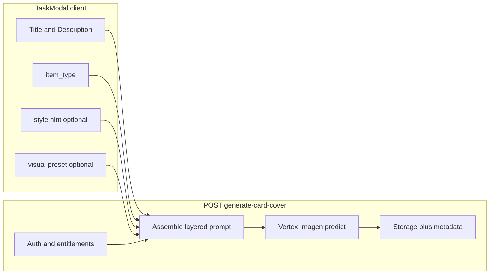

# Technical design: Card cover visualization (V1) — Buddy Bubble adaptation of Visualization Lab

## 1. Purpose

Card cover images generated today do not always **visually align** with the card’s **Title** and **Description**. This document drafts **V1** of a **Visualization Lab–inspired** pipeline for Buddy Bubble: structured inputs, optional presets, auditable prompts, and **compatibility across all `ItemType`s** (not only fitness).

**Reference implementation (fitness / exercise domain):**  
[interval-timers `apps/app/src/lib/visualization-lab`](https://github.com/jlfassio-vibecoder/interval-timers/tree/main/apps/app/src/lib/visualization-lab) — includes shared types, preview payload assembly, local template storage, demographics-style preset text groups, and export metadata bundling image + prompts + parsed context.

This TDD describes how to **adapt** those ideas to Buddy Bubble’s existing **Vertex Imagen** card-cover flow ([`generate-card-cover`](src/app/api/ai/generate-card-cover/route.ts), [`card-cover-prompt.ts`](src/lib/ai/card-cover-prompt.ts)).

---

## 2. What we borrow from Visualization Lab (conceptual)

| Interval Timers (fitness)                                                                                  | Buddy Bubble (polymorphic cards)                                                                                                                                                             |
| ---------------------------------------------------------------------------------------------------------- | -------------------------------------------------------------------------------------------------------------------------------------------------------------------------------------------- |
| `VizLabTemplate` — named saved form presets (`localStorage`)                                               | **Visual preset** templates: name + style/scene hints, optional default per workspace or user                                                                                                |
| `DEMOGRAPHICS_PRESETS` — grouped **literal** scene text (athlete, gym, age…)                               | **Scene archetype presets** — grouped **non-fitness** scene snippets (e.g. calendar block, workshop table, family table, trail horizon) chosen by **item type** + user                       |
| `buildSaveExercisePreview` / `buildExportMetadata` — structured payload: image + **imagePrompt** + sources | **Generation record**: final Imagen prompt (and optional intermediate “scene brief”) for support/debug; **sources** N/A unless we add grounding later                                        |
| `BiomechanicalPoints` + `parseBiomechanicalPoints` — intermediate structured semantics                     | Optional **V1.5+**: one **text** LLM step to turn title+description into a short **visual brief** (3–5 concrete phrases) before Imagen; **V1** can stay single-model if prompts are improved |
| `ResearchOnlyResult` / search chunks                                                                       | Out of scope for V1 (no Google Search grounding in current BB stack)                                                                                                                         |

---

## 3. Current state (Buddy Bubble)

- **Generation:** `POST /api/ai/generate-card-cover` builds one prompt via [`buildCardCoverImagePrompt`](src/lib/ai/card-cover-prompt.ts), calls Vertex Imagen, uploads to `task-attachments`, updates `metadata.card_cover_path`.
- **Gating:** `resolveSubscriptionPermissions` + task write checks (see existing AI card-cover design).
- **UI:** TaskModal hero + cover controls; optional user **style hint**.

**Gap:** A single monolithic prompt + general stock-friendly instructions can produce images that **underuse** or **misread** title/description (especially short titles, ambiguous wording, or non-visual domains).

---

## 4. Goals (V1)

1. **Stronger binding** between generated imagery and **Title + Description + ItemType** for every card kind.
2. **Preset system** analogous to Viz Lab “templates + demographics groups,” but expressed as **card-domain** scene/style presets (not athlete demographics).
3. **Explicit prompt structure** (layers) so engineering and support can see **what** was sent to Imagen.
4. **Backward compatible** API: existing clients keep working; new fields optional.
5. **No fitness-only assumptions** in shared code paths.

### Non-goals (V1)

- Multi-image sequences (Interval Timers “sequence” mode).
- Grounded web search / citation UI.
- Storing large prompt blobs in `tasks.metadata` without a product decision (see §8).

---

## 5. Proposed architecture

### 5.1 Layered prompt model (V1)

Assemble the Imagen prompt from **ordered sections** (implementation detail, not user-visible):

1. **Safety / brand** — existing family-friendly, no readable overlay text, etc.
2. **Item type contract** — what kind of card this is (event vs memory vs idea…).
3. **Subject block** — **verbatim** title and description (length-capped), labeled as “depict the subject matter of,” not as text to paint.
4. **Scene archetype** — user-selected preset string **or** default archetype inferred from `ItemType` (see §6).
5. **Style** — user hint + optional preset style (e.g. “editorial photo,” “flat illustration”).
6. **Output constraints** — 16:9 hero, `object-contain` friendly composition note for modal/board.

This mirrors Viz Lab’s separation of **domain context**, **demographics/scene**, and **visual style**, generalized for cards.

### 5.2 Optional “scene brief” step (V1.5, not V1)

Interval Timers uses an intermediate structured representation (biomechanical points). For Buddy Bubble, a later phase can add **one** Vertex/Gemini **text** call: `title + description + item_type → bullet visual brief` (50–100 words max), then feed **only the brief** + type into Imagen to reduce prompt noise. **V1** delivers value through **layering + presets** without a second model call.

---

## 6. Scene & style presets (replacement for “demographics”)

**File layout (suggested):** `src/lib/ai/card-cover-presets.ts` (or `visualization-lab/` namespace under Buddy Bubble).

- **`CARD_COVER_PRESET_GROUPS: { group: string; options: { id; label; text }[] }[]`**
  - Groups examples: **Professional / work**, **Community / social**, **Personal / memory**, **Fitness / movement** (optional narrow group), **Abstract / minimal**.
  - Each `text` is a short **scene/camera/lighting** phrase, **not** tied to a single ethnicity narrative unless product requests inclusive variants later.

- **Default preset id per `ItemType`** when the user does not choose one (deterministic mapping in code).

- **Templates (Viz Lab parity):** optional `localStorage` **named templates** `{ name, presetId, customHint }` for power users; can ship in **V1.1**.

---

## 7. API & client changes (V1)

### 7.1 Request body (`POST /api/ai/generate-card-cover`)

| Field          | Required | Description                                                   |
| -------------- | -------- | ------------------------------------------------------------- |
| `workspace_id` | yes      | Existing                                                      |
| `task_id`      | yes      | Existing                                                      |
| `hint`         | no       | Existing style hint                                           |
| `preset_id`    | no       | Id from `CARD_COVER_PRESET_GROUPS`; server resolves to `text` |

Server **ignores** unknown `preset_id` (fallback to type default).

### 7.2 Response (optional enrichment)

| Field                              | Description                                                                              |
| ---------------------------------- | ---------------------------------------------------------------------------------------- |
| `card_cover_path`                  | Existing                                                                                 |
| `metadata`                         | Existing                                                                                 |
| `debug` (dev only or feature flag) | `{ final_prompt_hash`, `preset_id` } — never log raw prompt in production without policy |

### 7.3 TaskModal UI

- Add **Visual preset** selector (compact `Select` or chip row) above or beside **Style hint**, scoped under the same entitlement as Generate cover.
- Pass `preset_id` to `postGenerateCardCover`.

---

## 8. Metadata & privacy

- **Do not** store full prompts in `tasks.metadata` by default (size, PII, reproducibility debates).
- **Do** log structured fields server-side: `task_id`, `user_id`, `item_type`, `preset_id`, `latency_ms`, `image_bytes` (V1 observability).
- If product requires reproducibility later: store `card_cover_generation: { preset_id, prompt_hash, model, at }` in metadata — separate migration + consent copy.

---

## 9. Phasing

| Phase    | Scope                                                                                                                                           |
| -------- | ----------------------------------------------------------------------------------------------------------------------------------------------- |
| **V1**   | Layered prompt builder + preset catalog + `preset_id` API + TaskModal selector; tighten copy so title/description are **primary subject** lines |
| **V1.1** | Local template save/load (Viz Lab `templates.ts` parity)                                                                                        |
| **V1.5** | Optional Gemini/Vertex **scene brief** text step before Imagen                                                                                  |
| **V2**   | Admin tuning, A/B on presets, rate limits, kill switch                                                                                          |

---

## 10. Open decisions

1. **Inclusive defaults** for human figures in presets (product + legal).
2. **Whether** non-owners may pick presets (same as AI generate button policy).
3. **Telemetry**: client `track` event `ai_card_cover_generated` with `preset_id`.

---

## 11. Acceptance criteria (V1)

- [ ] Generated images are **visibly** more aligned with **title + description** in QA across **at least one example per ItemType** (manual checklist).
- [ ] **Preset_id** round-trip: same card + same preset → reproducible **preset layer** (image may still vary).
- [ ] No regression: entitlement, storage path, RLS, TaskModal hero display.

---

_Document version: V1 draft. Source inspiration: [interval-timers visualization-lab](https://github.com/jlfassio-vibecoder/interval-timers/tree/main/apps/app/src/lib/visualization-lab)._
