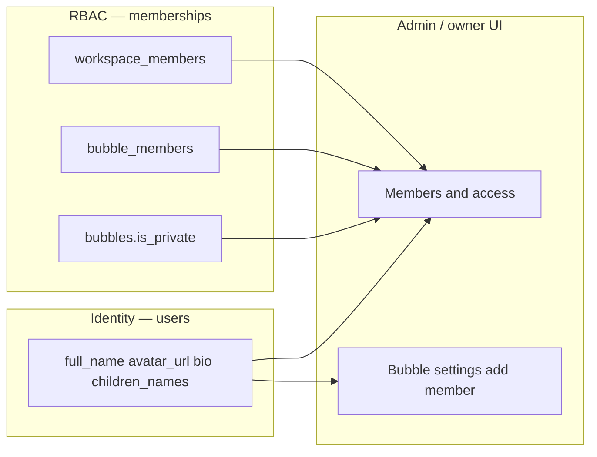

# Technical design: Invitee profile (self-service name, avatar, bio, Kids names) — v1.1

## 1. Problem

Invited members join BuddyBubble through **invite links / tokens** and land in a workspace with a minimal **`public.users`** row (often seeded from auth metadata). Product needs a clear **self-service profile** story: **display name**, **avatar**, **optional profile text**, and—**for Kids BuddyBubble**—**children’s names** on the parent account, so caregivers and owners see **recognizable people** everywhere the app lists members, permissions, chat, and presence—not opaque emails or UUIDs.

**Related doc:** Granular workspace/bubble access is specified in [`technical-design-granular-permissions-dashboard-v1.md`](./technical-design-granular-permissions-dashboard-v1.md). Profile data is the **identity layer** that permissions UIs and realtime surfaces **read**; it does not replace RBAC rules.

## 2. Goals

| Goal                                 | Description                                                                                                                                                                                                                                          |
| ------------------------------------ | ---------------------------------------------------------------------------------------------------------------------------------------------------------------------------------------------------------------------------------------------------- |
| **Self-service editing**             | Any signed-in **workspace member** (including **invitees**) can open **My profile** and edit fields allowed by RLS.                                                                                                                                  |
| **Avatar**                           | User can **upload** a profile photo; stored as a public URL on **`users.avatar_url`**.                                                                                                                                                               |
| **Name**                             | User can edit **`users.full_name`** (display name), distinct from auth email when needed.                                                                                                                                                            |
| **Profile information**              | Optional fields (e.g. **bio**); product may add **phone** if SMS flows need it.                                                                                                                                                                      |
| **Kids workspace: children’s names** | Account-level list of **child names** for caregivers in **`category_type = 'kids'`** workspaces (see §7).                                                                                                                                            |
| **Owner-visible identity**           | Completing profile fields updates **the same `users` row** that **Members & access**, bubble member pickers, and **presence** already join or consume—owners see **names and avatars** for active members without a separate “invite profile” model. |
| **RLS-aligned**                      | **`users_select_own` / `users_update_own`** and **`users_select_workspace_peers`**; no service-role bypass for normal flows.                                                                                                                         |

## 3. Non-goals (v1)

- **Per-workspace profile overrides** (different display name per workspace)—defer unless product requires it.
- **Admin editing another user’s profile** from the dashboard—out of scope; **workspace_members** / **bubble_members** remain role-only from owner/admin tools.
- **Child records as separate entities** (medical info, avatars per child)—v1 is **names on the parent account** only.
- **Storefront / public** profile pages—orthogonal; this doc is **in-app** profile for authenticated users.

## 4. As-built verification (codebase audit)

This section records what **already exists** in the repo so implementation does not duplicate or contradict current behavior.

### 4.1 Self-service profile (invitees and owners)

- **Entry point:** `ProfileModal` is opened from **`dashboard-shell`** via **`onOpenProfile`** (rail / account menu). There is **no dedicated `/profile` route** yet—the experience is **modal-only**.
- **Data:** `useUserProfileStore` (`src/store/userProfileStore.ts`) loads **`public.users`** for `auth.uid()`.
- **Edits:** `ProfileModal` updates **`full_name`**, **`avatar_url`**, **`timezone`** via the **browser Supabase client** (RLS). Avatars upload to bucket **`avatars`** using **`buildAvatarObjectPath`** / **`AVATARS_BUCKET`** (`src/lib/avatar-storage.ts`).
- **Invitees:** After accepting an invite, the user is a normal auth user + **`workspace_members`** row; they use the **same** profile modal and **`users`** row as the owner. Nothing is invite-token-specific at profile time.

### 4.2 Owner / admin management of members (not profile editing)

- **People & invites → Members & access:** `MembersSection` + **`listWorkspaceMembersAction`** (`member-actions.ts`) loads **`workspace_members`** with **`users(full_name, email, avatar_url)`**. Display name is **`full_name?.trim() || email || 'Unknown'`**; avatars render when **`avatar_url`** is set.
- **Roles and bubble access** are managed here (workspace role, **`bubble_members`** grants). Owners/admins **do not** edit another user’s name or avatar in this UI—only **membership and permissions**.

### 4.3 “Dropdown shows access, not names” — what the UI actually does

Two different surfaces are easy to conflate:

| Surface                                                  | What the dropdown is                                                                                       | How people are labeled                   |
| -------------------------------------------------------- | ---------------------------------------------------------------------------------------------------------- | ---------------------------------------- | ----- | ----- | ------------------------------------------------------------------------------------------------------------------------ | ----------------------------------------------------------------------------------------------------------------------------------------------------- |
| **Bubble settings → Add member** (`BubbleSettingsModal`) | **First** `<select>`: pick a **workspace member** not yet in **`bubble_members`**. Options: \*\*`full_name |                                          | email |       | user_id`**. **Second** `<select>`: **bubble role** only—**Editor** vs **Viewer** (granular **`bubble_members.role`\*\*). | If an invitee has **not** set **`full_name`**, the first dropdown falls back to **email** or **raw `user_id`**—which can feel like “not a real name.” |
| **Bubble settings → Existing members table**             | Per-row `<select>` under column **“Access”** is **only** Editor/Viewer.                                    | **Member** column shows \*\*`full_name   |       | email |                                                                                                                          | 'Unknown'`\*\*.                                                                                                                                       |
| **Members & access**                                     | Workspace role `<select>` (Owner/Admin/Member/Guest); separate bubble grid when expanded.                  | Names and avatars from **`users`** join. |

**Conclusion:** The app **does** prefer names where **`full_name`** is populated. The gap is **incomplete profiles** (empty **`full_name`**) and **no bio/Kids fields**, not a separate listing mode that sorts purely by access level. Improving **self-service profile** directly fixes **Add member** labels, **Members & access**, and **presence** (below).

### 4.4 Realtime presence and profile

- **`useUpdatePresence`** sends **`name`** = **`full_name` || email local-part || `'Member'`** and **`avatar_url`** from **`userProfileStore`** to the workspace presence channel.
- **`ActiveUsersStack`** sorts online users by **`user_id`** (not alphabetically by name); tooltips use the **presence payload `name`**.

### 4.5 Reference: files and schema

| Area               | Location / notes                                                                                                                                            |
| ------------------ | ----------------------------------------------------------------------------------------------------------------------------------------------------------- |
| User row           | `public.users`: `id`, `email`, `full_name`, `avatar_url`, `timezone`, `created_at` (`src/types/database.ts`). **No `bio` / `children_names` in types yet.** |
| Workspace template | `workspaces.category_type`: `'business' \| 'kids' \| 'class' \| 'community'`.                                                                               |
| RLS                | `users_select_own`, `users_update_own`; peers via `users_select_workspace_peers` (initial schema + later migrations).                                       |
| Avatars storage    | Bucket **`avatars`**; **replace/delete** policies may be incomplete—see §9.1.                                                                               |
| Invites            | `src/app/invite/[token]/` — post-accept, user is a normal member.                                                                                           |

## 5. Integration with granular permissions (RBAC v1)

**Single source of truth for “who”:** `public.users` (identity: name, avatar, future bio/Kids names).

**Single source of truth for “what they can do”:** `workspace_members.role`, `bubble_members`, `bubbles.is_private`, RLS, and **`src/lib/permissions.ts`** (see [`technical-design-granular-permissions-dashboard-v1.md`](./technical-design-granular-permissions-dashboard-v1.md)).

**How they connect:**

1. **Members & access** already **JOIN**s **`users`** for each **`workspace_members`** row. When an invitee updates **`full_name`** / **`avatar_url`**, the **next load** of **`listWorkspaceMembersAction`** shows the new identity—no change to RBAC tables.
2. **`listWorkspaceMembersForBubbleAction`** / **`listWorkspaceBubbleAccessAction`** use the same pattern: workspace-scoped queries + **`users`** profile fields for labels.
3. **Presence** reuses **`userProfileStore`**; after **`setProfile`**, reconnect or presence update paths should reflect new display strings (today presence effect depends on **`profile?.full_name`** etc.).
4. **Future:** If **`children_names`** or **`bio`** should appear in admin surfaces, extend the **SELECT** in member-list actions to include those columns **only if** product wants owners to see them (same RLS as **`full_name`** for peers).

## 6. UX concept

### 6.1 Entry points

- **Primary (today):** Rail / account menu → **Profile** → `ProfileModal`.
- **Recommended (v1 implementation):** Optional dedicated route **`/app/profile`** (or global layout) for deep links and larger forms (bio, Kids list), still writing the same **`users`** row.
- **Secondary:** Banner or hint on **People & invites** when **`full_name`** is missing or default-looking.

### 6.2 Form structure (target)

1. **Header:** “Your profile” — copy: _Shown to people in workspaces you share_ (aligns with peer RLS).
2. **Avatar:** upload / remove; keep parity with existing `ProfileModal` behavior.
3. **Display name:** `full_name`.
4. **Profile information:** optional **bio** (new column or `profile_extra`—§7).
5. **Kids — Children:** When user is in ≥1 **`kids`** workspace (or always-on with helper text—product pick): dynamic list of names → **`children_names`** (§7).
6. **Timezone:** already in `ProfileModal`—retain.

### 6.3 Validation

- **Name:** trim, max length (e.g. 120).
- **Kids names:** trim, max per name (e.g. 64), max children (e.g. 8).
- **Avatar:** align with bucket limits and MIME allowlist.

## 7. Data & API design

### 7.1 Schema extension

**Today:** no **`bio`** or **`children_names`** on **`users`** in generated types.

**Recommendation:**

| Field            | Storage                                     | Notes                                                                                                                                       |
| ---------------- | ------------------------------------------- | ------------------------------------------------------------------------------------------------------------------------------------------- |
| Bio              | `users.bio text` nullable                   | Simple to query in member JOINs.                                                                                                            |
| Children’s names | `users.children_names jsonb` default `'[]'` | Validate in app (Zod); optional **`CHECK`** on array size. Shape e.g. `{ "names": ["Alex", "Sam"] }` or string array—pick one and document. |

Alternatives (`profile_extra jsonb` only, or `user_children` table) remain valid for later refactors.

### 7.2 Server vs client writes

**Current pattern:** `ProfileModal` uses **client** `users.update` + storage upload.

**Target:** Either keep client + RLS (minimal change) or add **`updateMyProfileAction`** / **`getMyProfileAction`** for validation centralization—especially for **jsonb** children arrays.

### 7.3 Who sees children’s names and bio

Default **v1:** Same visibility as **`full_name`** for workspace peers (**`users_select_workspace_peers`**). Document in UI. Tighter scoping (Kids-only workspaces) requires policy or join complexity—explicit non-goal unless product mandates.

## 8. Avatar upload flow

Unchanged from prior revision: upload to **`avatars`**, set **`avatar_url`**, refresh **`userProfileStore`**.

### 8.1 Replacing an existing avatar

Confirm **storage** policies allow lifecycle for **`public/{uid}-*`** objects (insert-only today may block delete/replace—close before broad rollout).

## 9. Security & compliance

| Topic          | Guidance                                                                                               |
| -------------- | ------------------------------------------------------------------------------------------------------ |
| **RLS**        | New columns on **`users`** must be covered by **`users_update_own`** / **`WITH CHECK`** as applicable. |
| **Kids data**  | Privacy copy on form; optional future visibility rules.                                                |
| **Validation** | Server-side validation for all text/jsonb.                                                             |

## 10. UI implementation notes

- **Modal vs page:** Start from existing **`ProfileModal`**; add sections for **bio** and **Kids** when columns exist.
- **Kids visibility:** Query whether the user has any **`workspace_members`** row where **`workspaces.category_type = 'kids'`** (client or small server helper).
- **Theme:** Use **`ThemeScope`** if embedding in themed shells (see invites modal).

## 11. Migration checklist (engineering)

1. Migration: **`bio`**, **`children_names`** (if approved).
2. Regenerate **`src/types/database.ts`**.
3. Extend **`ProfileModal`** (or new profile page) + **`UserProfileRow`** usage.
4. Storage policy hardening for avatars.
5. Smoke-test: **invitee** updates name/avatar → **Members & access**, **Bubble settings → Add member**, and **presence** show new identity.

## 12. Open questions

1. **Phone** on profile vs invite-only collection?
2. **Kids names:** peers in **all** shared workspaces vs **kids** workspaces only?
3. **Profile completeness gates** (e.g. require ≥1 child name in Kids workspace)—product rule.

---

**Document version:** v1.1 · **Last updated:** 2026-04-10 · **Owner:** Product + Engineering (BuddyBubble)
